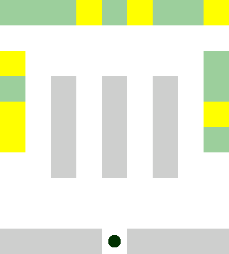

# 성능 비교 🤔

제작한 Agent 와의 성능을 비교하기 위해
게임 업계에서 주로 채택되는 Astar Algorithm 을 구현해 보았다.

해당 알고리즘은 목적지와의 최단 거리를 휴리스틱하게 찾아낸다.

### A* algorithm 🤢

파란색 상자는 Agent 가 행동하기 이전 최단 거리를 탐색하는 과정이다.
탐색에 총 87 Action.  
행동에 총 42 Action.  

도합 129번의 행동을 한다.

반면에 강화학습 알고리즘인 DQN 을 적용한 Agent는 학습한 파라미터에 의해  
바로 다음 Action을 취하기 때문에 탐색과정을 생략할 수 있다.

### DQN algorithm 😁

행동 42 Action 만으로 성공하는 모습을 확인할 수 있다.

