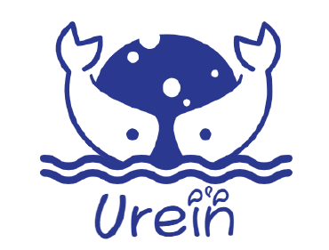
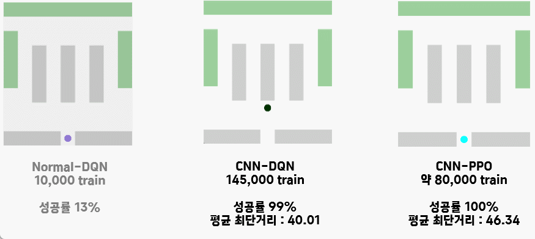
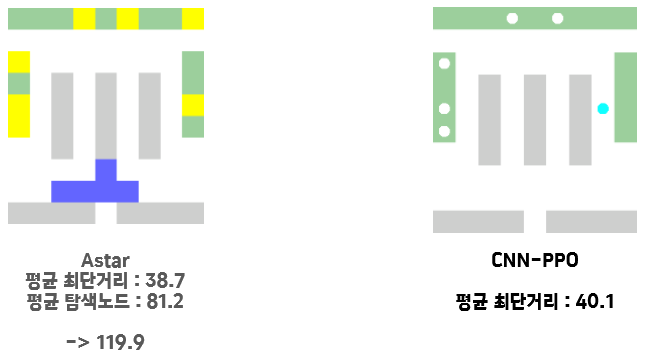

# 물류 선적 최적화 인공지능 개발

  
<strong>&nbsp;Table of Contents</strong>

&nbsp;  
[About The Project](#about-the-project) 
[Code Description](#code-description) 
[Team Members](#team-members) 
[Result](#result) 

## About The Project

**1. 개요**

2차원으로 주어지는 상품 리스트와 위치데이터를 받았을 때, 최적의 길을 판단하는 강화학습 인공지능 모델을 개발하였습니다. 이를 통해 물류시스템의 자동화 구현이 가능합니다. 

강화학습 솔루션 기업인 (주)애자일소다와 함께 진행하였습니다.

**예시**

## Code Description

`model` 에는 네 가지 모델을 구현하였습니다. Actor-critic, DQN, PPO는 각각 강화학습 알고리즘 모델입니다. Astar 는 구현한 알고리즘의 성능을 측정하기 위한 비교 휴리스틱 알고리즘입니다.  

`Sim.py` 에는 물류의 지도를 는 물류의 장소를 나타내는 `grid` 와, 물류를 선적하는 `agent` 의 정보가 존재하며, `agent`의 다음 행동에 따라 지속적으로 정보를 갱신합니다. 

### 1. grid
1. 상품은 동시에 최대 7개 존재
2. A~Q 까지 20개의 상품 존재
3. 장소의 크기는 9x4
4. agent의 행동에 따라 reward 지급

### 2. agent
1. 상하좌우로 이동
2. 현재위치를 grid에 전달

## Team Member

| Name  |Role|Github  |
| :------------ |:---------------:| :-----|
| 박준희      |Team Leader |https://github.com/phthys |
| 정문희      |Environment| https://github.com/flowerJung |
| 이광민      |Recording| https://github.com/kwang-min-lee1 |
| 김영철      |PPO, A2C| https://github.com/youngchurl |
| **하성민**      |DQN| https://github.com/xman227 |

## Result

물류 선적 및 이동 시간을 Astar 알고리즘 대비 67% 감축하였습니다.

